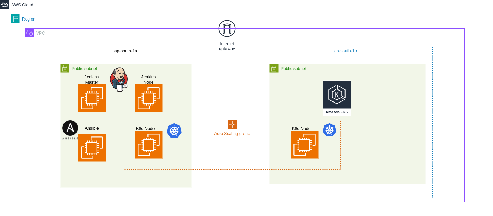

# DevOps Project - CI/CD Pipeline with AWS, Jenkins, Ansible, and EKS

## Overview

This project presents a comprehensive DevOps solution integrating various tools to streamline the software development lifecycle. The primary components include Jenkins for Continuous Integration (CI), Ansible for infrastructure provisioning, SonarQube for code quality analysis, JFrog Artifactory for artifact management, and Amazon EKS (Elastic Kubernetes Service) for container orchestration.


## Features

- **Jenkins CI/CD Pipeline:** Utilizes a master/slave architecture on AWS EC2 instances for building, testing, and deploying code.
- **Ansible Automation:** Automates the provisioning and configuration of AWS EC2 instances, ensuring consistent infrastructure.
- **SonarQube Integration:** Implements continuous code quality analysis to enhance code maintainability.
- **JFrog Artifactory:** Manages artifacts efficiently, facilitating seamless integration with the CI/CD pipeline.
- **Amazon EKS Deployment:** Orchestrates containerized workloads, deploying a small-scale Java application on Kubernetes.
- **GitHub Integration:** Ensures version control and collaboration, enhancing code collaboration and traceability.

## Getting Started

### Prerequisites

- Install Jenkins, Ansible, SonarQube, and JFrog Artifactory.
```sh
   terraform -version
   ```

- Set up AWS EC2 instances for Jenkins and Ansible.
```sh
    sudo apt install ansible
```
- Configure AWS EKS cluster for Kubernetes deployment.

### Usage

1. Clone the repository.
2. Configure Jenkins jobs for CI/CD.
3. Run Ansible playbooks for infrastructure provisioning.
```sh
ansible-playbook jenkins_master.yaml -l master
ansible-playbook jenkins_maven_slave.yaml -l slave
```
4. Integrate SonarQube for code quality checks.
5. Utilize JFrog Artifactory for artifact management.
6. Update kube config on Jenkins
```sh
 aws eks --region region-name get-token --cluster-name cluster-name --output json
```
6. Deploy the Java application on Amazon EKS.


